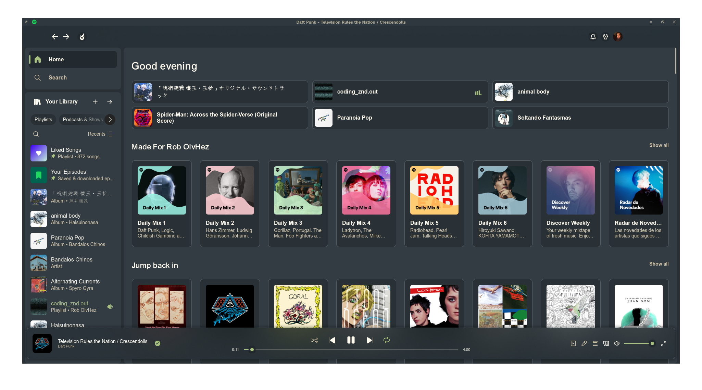
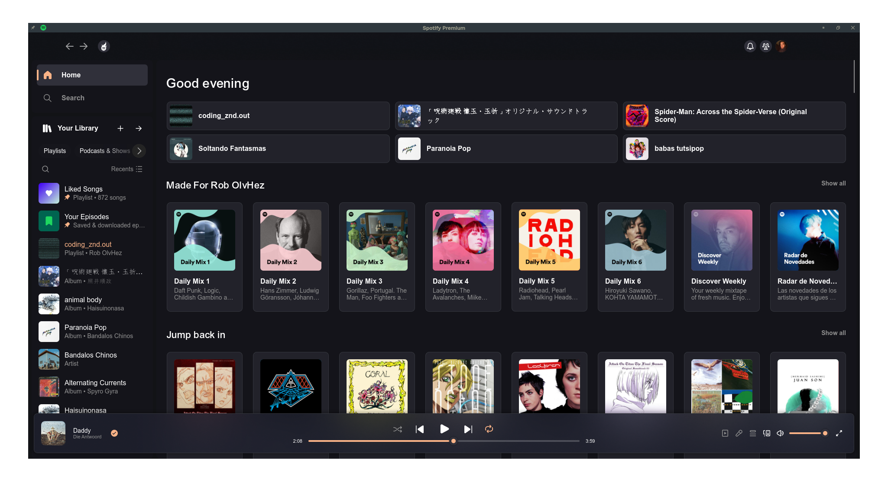

# 🎵 Spicetify

Spicetify is a CLI tool that allows to change and control the Spotify client on your computer.

It is available as `spicetify-cli` in the [Spicetify - AUR](https://aur.archlinux.org/packages/spicetify-cli) for easy installation.

```shell
$ yay -S spicetify-cli
```

## 🔧Theme installation
The Spicetify theme used is the [Bloom](https://github.com/nimsandu/spicetify-bloom) theme. Follow [installation](https://github.com/nimsandu/spicetify-bloom#installation) instructions to download the theme. 

Or, simply download or copy the contents of the `src/` files and copy the files in the `~/.config/spicetify/Themes/Bloom` directory of the Spicetify configs (or your prefered config directory).

Once installed, apply the theme using terminal

```shell
spicetify config current_theme Bloom
spicetify config inject_css 1 replace_colors 1 overwrite_assets 1 inject_theme_js 1
```

## 🎨 Color Schemes

To apply the color schemes use (from available options such as `everforestdark`, `catpuccin_macchiato`)

```shell
spicetify config color_scheme <color scheme>
spicetify apply
```

> Some colors in the `color.ini` file have the comment `; accent color`, this means the line **below** dictates the accent color (ie. buttons, player index, volume, etc.)

<div style="text-align:center;">


**Everforest Dark Theme**


**Catpuccin Macchiato Theme (Default: Peach accent)**


**Dracula Theme (Green accent)**

</div>


